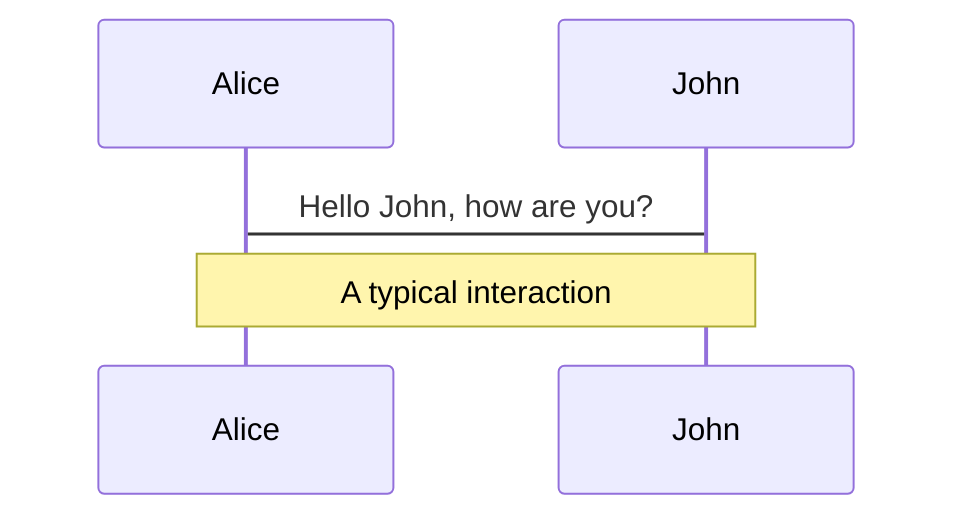
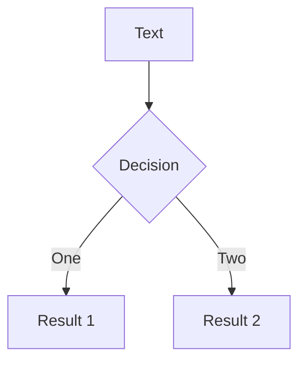

---
# try also 'default' to start simple
theme: purplin
# random image from a curated Unsplash collection by Anthony
# like them? see https://unsplash.com/collections/94734566/slidev
background: https://source.unsplash.com/collection/94734566/1920x1080
# apply any windi css classes to the current slide
class: 'text-center'
# https://sli.dev/custom/highlighters.html
highlighter: shiki
# some information about the slides, markdown enabled
layout: quote
position: center
info: |
  ## Slidev Starter Template
  Presentation slides for developers.

  Learn more at [Sli.dev](https://sli.dev)
  
---

# Cloud RAN for Mobile Networks—A Technology Overview
Aleksandra Checko, Henrik L. Christiansen, Ying Yan, Lara Scolari, Georgios Kardaras, Michael S. Berger, and Lars Dittmann

松田研　B4 野中創矢

---

# Abstract
- クラウド無線アクセスネットワーク(C-RAN)は多くの課題を解決することができる新しいアーキテクチャ
- ベースバンドユニット(BBU)を中央のBBUプールに集約
- 統計的多重化を測り,同相・直交(IQ)データの高速有線伝送に負荷を移す.
- エネルギー効率の高いネットワークを運用可
- ベースバンドの資源のコスト削減に繋がる.
- 負荷分散と協調処理によるネットワーク容量の向上
- 本論文はC-RANの研究を進める人のための出発点

---

# I.Introduction
背景
- 携帯のデータ通信量は増加し続けている.
- 増大するユーザーの需要を満たすため,ネットワーク容量を増やす必要.
- LTEのスペクトル効率がシャノン限界に近づいている.
- ネットワーク容量を増加するために有力な方法
  - セルを追加してHetSNets（Heterogeneous and Small cell Networks）の複雑な構造を構築
  - MIMOやMassive MIMOの技術を実装し,同時同周波数でサービスを提供
- 上記方法ではセル間干渉レベルが増大し,コストも高い

---

# I.Introduction
経済的なお話

モバイルネットワークの総所有コストには以下の２つがある.
- **CAPEX（CAPital EXpenditure：資本的支出)**
  - ネットワーク構築に関連する費用.機器,土木,電力,冷房など
- **OPEX(OPerating EXpenditure：事業運営費)**
  - ネットワークを運用するために必要な費用.電力,運用,保守,アップグレード等.
- CAPEXとOPEXは基地局の数が増えると大幅に増加
- 例えば,総消費電力の72%はセルサイトに起因すると推定
---

# I.Introduction
赤字になりそうでヤバイ

- 典型的なユーザーはデーターを欲しがる一方でデータ使用量に対する支払いが少なくなることを期待
- ユーザー1人あたりの平均収入(ARPU)は時間と共に横ばいまたは減少する.
- ネットワークコストが収入を上回る可能性に直面
- コストとエネルギー消費を最適化する新しいアーキテクチャが必要

<br>
<div grid="~ cols-2 gap-2" m="-t-2">
  <p></p>
  
</div>
---

# I.Introduction
C-RAN

C-RANは前述した課題を解決する可能性を持つ新しいアーキテクチャ
- ベースバンド処理が集中化され,仮想化されたBBUプールサイト間で共有される.
  - 均一ではないトラフィックにも対応できる.
  - 基地局を効率的に利用することが可能
- 従来のアーキテクチャに比べて必要なBBUの数が少ない.
  - 電力やエネルギー消費を抑える.
  - ネットワーク運用コストを削減できる可能性がある.
- 新しいBBUを容易に追加,アップグレードできる.
  - スケーラビリティの向上,メンテナンスが容易に
---


# I.Introduction
C-RAN

- 仮想化されたBBUプールは異なる事業者間で共有することが可能　
  - RANをクラウドサービスとしてレンタルすることができる.
- 複数サイトのBBUが1つに集約していることにより,ICICやCoMPが容易になる.
- セル間の負荷分散も容易に
- intra-BBUプール　間のハンドオーバーを軽減することでネットワーク性能も向上
---


# I.Introduction
C-RANの対抗馬(スモールセル)

- 5Gにおいて,ソフト技術とグリーン技術を統合したモバイルネットワークの典型的な実現方法の１つ
- C-RAN以外の解決法として,スモールセル,HetSNetsの一部,Massive MIMOがある.
- スモールセルは屋外のホットスポット,屋内のカバーに
- LightRadioのような技術により,数Lの箱に全てのBSを構築可能
- 屋外に設置可能で,冷却などのコストを削減できる
- C-RANと比べ,アップグレード,修理が難しい
---

# I.Introduction
C-RANの対抗馬(HetSNets,Massive MIMO)

- 大規模スモールセルネットワークはMassiveMIMOよりもエネルギー効率が高い
- LTE マクロ基地局,LTE C-RAN,LTE スモールセルの8年間のCAPEX,OPEXを含むTCOを比較
  - 1Mb/sあたりの総輸送コスト
  - マクロセル:2200\$,C-RAN:1800\$,スモールセル:600\$
  - C-RANは高い輸送コストに見合った大きなメリットが必要
- スタジアム中継等の特殊ケースでC-RANを利用すると良い？
- 安価,無料なファイバーリソースを利用できる事業者にとってCーRANは魅了的
---

# I.Introduction
本論文について
- 本論文ではC-RANとその実装に関する最新の文献を調査した.
- 本論文の構成は以下の通りである.
  - Section 2:C-RANアーキテクチャの基本的な側面の紹介
  - Section 3:C-RANアーキテクチャの利点
  - Section 4:利点を活用するための課題
  - Section 5:C-RANのトランスポートネットワーク容量に関するいくつかの制約
  - Section 6,7:C-RAN実現に必要な最先端ハードウェアソリューション
  - Section 8:BBUプール内に導入可能な仮想技術
  - Section 9:C-RAN展開シナリオの評価
  - Sectiono 10:C-RANに関する進行中の研究
  - Section 11:まとめ
---


---
layout: quote
position: center

---
# II. WHAT IS C-RAN? BASE STATION ARCHITECTURE EVOLUTION

---

# II. WHAT IS C-RAN?
C-RAN
- C-RANはベースバンドリソースをプールし,基地局間で共有できるようにしたもの
- 本章では基地局の進化とC-RANコンセプトの起訴について紹介 

---

# II. WHAT IS C-RAN?
C-RAN
- モバイルネットワークがカバーする領域はセルに分割されている
- ユーザーは自分がいるセルをカバーする基地局と通信している.
- 基地局の主な機能はベースバンド処理モジュールと無線モジュールに分けられる
- ベースバンド処理:符号化,変調,FFT　　無線:デジタル処理,周波数フィルタリング,電力増幅

---


# II. WHAT IS C-RAN?
A. Traditional Architecture
<div grid="~ cols-2 gap-2" m="-t-2">
  <ul>
    <li>従来アーキテクチャではベースバンド処理機構と無線機構が基地局内に統合されていた</li>
    <li>アンテナモジュールは無線モジュールの近くに配置されている</li>
    <li>基地局間はX2インターフェースでつながっている</li>
    <li>基地局とモナイルコアネットワーク間はS1インターフェースでつながっている</li>
    <li>1Gや2Gにてよく用いられた</li>
　 </ul>
  
</div>
---

# II. WHAT IS C-RAN?
B. Base Station With RRH
<div grid="~ cols-2 gap-2" m="-t-2">
  <ul>
    <li>RRH(Remote Radio Head)を用いたアーキテクチャ</li>
    <li>基地局を無線ユニットと信号処理ユニットに分離する</li>
    <li>無線ユニットはRRHまたはRRU(Remote Radio Unit)と呼ばれる</li>
    <li>RRHはファイバーへのインターフェースを提供し,無線処理を行う</li>
    <li>信号処理ユニットはBBUまたはDU(Data Unit)と呼ばれる</li>
    <li>3Gにて導入され,現在では大半がこのアーキテクチャをとる</li>
　 </ul>
  
</div>
---

# II. WHAT IS C-RAN?
B. Base Station With RRH
- RRH-BBU間の距離は最長40km
- 光ファイバーやマイクロ波による接続が可能
- BBUを便利でアクセスしやすい場所に設置することができ,コスト削減につながる
- RRHはBBUに静的に割り当てられ,1つのBBUで多数のRRHにも対応できる
- RRHとBBUを繋ぐIrインターフェースが定義されている.
- CPRI(Common Public Radio Interface)というIr上のRRH-BBU間IQデータ伝送に使用されるプロトコルがある.
- OBSAI(Open Base Station Architecture Initiative),ORI(Open Radio Equipment Interface)等のプロトコルも使用可能
---


# II. WHAT IS C-RAN?
C. Centralized Base Station Architecture—C-RAN
<div grid="~ cols-2 gap-2" m="-t-2">
  <ul>
    <li>C-RANではBBUをBBU/DU PoolまたはHotelと呼ばれる1つのエンティティに集中させる.</li>
    <li>高負荷の基地局と低負荷の基地局の間でBBUの利用を最適化</li>
    <li>BBUプールはセルサイト間で共有され仮想化された,BBUのクラスタ.</li>
    <li>X2インターフェースはX2+と新た強い形でクラスター間の通信を整理</li>
    <li>Cは様々な意味にとらえられる</li>
    <li>e.g)Cen-tralized Processing,Cooperative Radio,Collaborative,Clean</li>
　 </ul>
  
</div>
---

# II. WHAT IS C-RAN?
C. Centralized Base Station Architecture—C-RAN
<div grid="~ cols-2 gap-2" m="-t-2">
  <ul>
    <li>フロントホールはRRHからBBUまでの範囲をカバー</li>
    <li>バックホールはBBUプールとモバイルコアネットワークを接続</li>
    <li>リモートサイトではRRHはアンテナと一緒に配置さている.</li>
    <li>RRHは低遅延,高帯域の光トランスポートリンクを通じBBUプール内のプロセッサに接続している</li>
    <li>IQサンプルはRRH-BBU間で送信される</li>
　 </ul>
  
</div>
---


# II. WHAT IS C-RAN?
各アーキテクチャの比較
<div grid="~ cols-2 gap-2" m="-t-2">
  <ul>
　 </ul>
  
</div>
---


# III. ADVANTAGES OF C-RAN
A. Adaptability to Nonuniform Traffic and Scalability
<div grid="~ cols-2 gap-2" m="-t-2">
  <ul>
    <li>1日の内にユーザーは異なるエリアを行き来する</li>
    <li>右図はネットワーク負荷の1日の変化を表す</li>
    <li>ユーザーがオフィスから住宅地に移動すると移動先のエリアで膨大な処理能力が浪費される</li>
    <li>C-RANでは複数セルのベースバンド処理をBBUプールで行うため全体の利用率を向上できる</li>
　 </ul>
  
</div>
---


# III. ADVANTAGES OF C-RAN
概要
- C-RANはマクロセルとスモールセルの両方にメリッどがある
- 以下のようなメリットが
  - 基地局導入と運用コストの削減
  - 消費電力を削減
  - ネットワークアップグレードの柔軟性を高める
  - 不均一なトラフィックへの適応性の実現
  - CoMP,干渉緩和等のLTE-A機能を効率的にサポートできる
- BBUプールにデータをキャッシュしておくことで,応答時間が短くなる.
  - スモールセルの展開には欠かせない
- 本章では3つの利点を述べ動機付けを行っていく.
---


# III. ADVANTAGES OF C-RAN
A. Adaptability to Nonuniform Traffic and Scalability
- BBUプールに必要なBBU数は単一基地局の合計よりも小さくなることが予想される.
- 東京都市圏では従来に比べ75%,BBUの数を削減できることが示されている.
- 特定のトラフィックパターンの場合,必要なBBUが従来よりも4倍少なく済む
- 統計絵的多重化利得はトラフィックミックスに応じて1.2~1.6の間で変化し,17~38%の節約が可能になる
- 基地局間の処理負荷のばらつきを利用し集中型アーキテクチャを構築することで、計算資源を少なくとも22%節約できる可能性
- データトラヒックが計算し原利用率の変動に影響を与えることは証明されている.
  - 複数のセクターを1つのクラウド基地局に集約すれば大幅な多重化が可能になる.
  - e.g)57セクターを1つのBBUプールに集約すると計算資源が25%節約できる
---

# III. ADVANTAGES OF C-RAN
A. Adaptability to Nonuniform Traffic and Scalability
- 統計的利得の最大化
  - トラフィックプロファイルに合わせてRRH-BBUプール間で柔軟に再構成可能なマッピングを用いる.
  - 特定のトラフィックプロファイルを持つRRHを異なるBBUプールに接続する.
- アップグレードには新しくRRHを設置しBBUプールにつなげるだけで良い
- BBUプール自体はハードウェアを交換,新設することでアップグレード可能
- BBUプールとセルの両方でロードバランシングが可能
  - BBU側:BBUプール内の適切なBBUリソース割り当て問題
  - セル側:動的にBBUが割り当てられるので,制約なしにユーザーのセルを切り替える
---


# III. ADVANTAGES OF C-RAN
B.Energy and Cost Savings Coming From Statistical Multiplexing Gain in BBU Pool
- エネルギーを節約した結果としてコストが削減できる
- C-RANは従来のRANと比べ67%~80%の電力削減を可能にすると見積もられている
- 合計でCAPEXは15%,OPEXを50%削減できると考えられている
- しかし,BBUプール-RRHサイト間のファイバー費用がCAPEXを増加させる可能性もある
- RRH-BBU間で伝送されるIQヘッドは大きなオーバーヘッドをもたらす
  - 伝送ネットワークの設置と運用には大きなコストがかかる.
---


# III. ADVANTAGES OF C-RAN
C. Increase of Throughput, Decrease of Delays
- LTE及びLTE-AはC-RANで展開される可能性が最も高い
- ここではeICIC,CoMPで提案されているLET-Aメカニズムについて紹介
- eICIC,CoMPをよく理解することで,C-RANの利用機会について分かる
---

# III. ADVANTAGES OF C-RAN
C. Increase of Throughput, Decrease of Delays
- OFDMA(直行周波数分割多重アクセス)を利用
  - 共有リソースのみで動作.
  - LTEの基地局(evoleved Node B:eNB)にはリソース割り当てを行うスケジューラーがある.
- 周波数再利用率が1であり,全てのセルが同一周波数で動作
  - セル間干渉が非常に大きい
- 干渉を抑えるための2つのアプローチ
  - 1.干渉を最小限に抑える
  - 2.干渉経路を建設的に利用する
---


# III. ADVANTAGES OF C-RAN
1) Minimizing Inter Cell Interference
- セル間干渉は静的,動的に解決可能
- 静的方法
  - そもそも同一周波数を使わない
  - 隣接セルで異なる周波数を利用
  - ハードな周波数再利用と呼ばれる
- フラクショナルな周波数再利用も可能
- しかしlower bandsの周波数資源は乏しいため,周波数再利用法以外の方法が良い
  - 本セクションでは全てのセルで同一周波数を使用されている場合に焦点を当てる
---


# III. ADVANTAGES OF C-RAN
1) Minimizing Inter Cell Interference
<div grid="~ cols-2 gap-2" m="-t-2">
  <ul>
    <li>ICIC（Inter-cell Interference Coordination：セル間干渉調整）</li>
    <li>1.UEが特定のサブキャリアで強い干渉を受信</li>
    <li>2.eNBに報告</li>
    <li>3.各eNBがサブキャリアが特定のUEに使用されないよう,近隣セルと連携し調整</li>
    <li>これらはセル端のUEにのみ適用され,セル中央付近では全てのリソースを利用可能</li>
　 </ul>
  
</div>
---

# III. ADVANTAGES OF C-RAN
1) Minimizing Inter Cell Interference
- 比較的シンプルなソリューション
- eNBは負荷情報とスケジューリング情報を交換するだけで済む
- 欠点も存在
  - 隣接セルの干渉を考慮しなければいけない場合,最適なスケジューリングが決定できない
  - 制御チャネルは固定リソースで送信されるため,干渉が発生する.
---


# III. ADVANTAGES OF C-RAN
1) Minimizing Inter Cell Interference
- eICIC(enhanced ICIC)
- 特定のサブフレームがミュートされることを意味するABS(Almost Blank Sub-Frames)を導入
  - CRSなどの一部の信号は送信されているため,Almost
- 信号をミュートし,その間に重要な情報を送信できるようになる.
---


# III. ADVANTAGES OF C-RAN
1) Minimizing Inter Cell Interference
- eICIC(enhanced ICIC)
- 特定のサブフレームがミュートされることを意味するABS(Almost Blank Sub-Frames)を導入
  - CRSなどの一部の信号は送信されているため,Almost
- 信号をミュートし,その間に重要な情報を送信できるようになる.
---


# What is Slidev?

Slidev is a slides maker and presenter designed for developers, consist of the following features

- 📝 **Text-based** - focus on the content with Markdown, and then style them later
- 🎨 **Themable** - theme can be shared and used with npm packages
- 🧑‍💻 **Developer Friendly** - code highlighting, live coding with autocompletion
- 🤹 **Interactive** - embedding Vue components to enhance your expressions
- 🎥 **Recording** - built-in recording and camera view
- 📤 **Portable** - export into PDF, PNGs, or even a hostable SPA
- 🛠 **Hackable** - anything possible on a webpage

<br>
<br>

Read more about [Why Slidev?](https://sli.dev/guide/why)

<!--
You can have `style` tag in markdown to override the style for the current page.
Learn more: https://sli.dev/guide/syntax#embedded-styles
-->

<style>
h1 {
  background-color: #2B90B6;
  background-image: linear-gradient(45deg, #4EC5D4 10%, #146b8c 20%);
  background-size: 100%;
  -webkit-background-clip: text;
  -moz-background-clip: text;
  -webkit-text-fill-color: transparent; 
  -moz-text-fill-color: transparent;
}
</style>

---

# Navigation

Hover on the bottom-left corner to see the navigation's controls panel, [learn more](https://sli.dev/guide/navigation.html)

### Keyboard Shortcuts

|     |     |
| --- | --- |
| <kbd>right</kbd> / <kbd>space</kbd>| next animation or slide |
| <kbd>left</kbd> | previous animation or slide |
| <kbd>up</kbd> | previous slide |
| <kbd>down</kbd> | next slide |


<p v-after class="absolute bottom-23 left-45 opacity-30 transform -rotate-10">Here!</p>

---
layout: image-right
image: https://source.unsplash.com/collection/94734566/1920x1080
---

# Code

Use code snippets and get the highlighting directly!

```ts {all|2|1-6|9|all}
interface User {
  id: number
  firstName: string
  lastName: string
  role: string
}

function updateUser(id: number, update: User) {
  const user = getUser(id)
  const newUser = {...user, ...update}  
  saveUser(id, newUser)
}
```

<arrow v-click="3" x1="400" y1="420" x2="230" y2="330" color="#564" width="3" arrowSize="1" />

---

# Components

<div grid="~ cols-2 gap-4">
<div>

You can use Vue components directly inside your slides.

We have provided a few built-in components like `<Tweet/>` and `<Youtube/>` that you can use directly. And adding your custom components is also super easy.

```html
<Counter :count="10" />
```

<!-- ./components/Counter.vue -->
<Counter :count="10" m="t-4" />

Check out [the guides](https://sli.dev/builtin/components.html) for more.

</div>
<div>

```html
<Tweet id="1390115482657726468" />
```

<Tweet id="1390115482657726468" scale="0.65" />

</div>
</div>


---
class: px-20
---

# Themes

Slidev comes with powerful theming support. Themes are able to provide styles, layouts, components, or even configurations for tools. Switching between themes by just **one edit** in your frontmatter:

<div grid="~ cols-2 gap-2" m="-t-2">

```yaml
---
theme: default
---
```

```yaml
---
theme: seriph
---
```


</div>

Read more about [How to use a theme](https://sli.dev/themes/use.html) and
check out the [Awesome Themes Gallery](https://sli.dev/themes/gallery.html).

---
preload: false
---

# Animations

Animations are powered by [@vueuse/motion](https://motion.vueuse.org/).

```html
<div
  v-motion
  :initial="{ x: -80 }"
  :enter="{ x: 0 }">
  Slidev
</div>
```

<div class="w-60 relative mt-6">
  <div class="relative w-40 h-40">
    
    
    
  </div>

  <div 
    class="text-5xl absolute top-14 left-40 text-[#2B90B6] -z-1"
    v-motion
    :initial="{ x: -80, opacity: 0}"
    :enter="{ x: 0, opacity: 1, transition: { delay: 2000, duration: 1000 } }">
    Slidev
  </div>
</div>

<!-- vue script setup scripts can be directly used in markdown, and will only affects current page -->
<script setup lang="ts">
const final = {
  x: 0,
  y: 0,
  rotate: 0,
  scale: 1,
  transition: {
    type: 'spring',
    damping: 10,
    stiffness: 20,
    mass: 2
  }
}
</script>

<div
  v-motion
  :initial="{ x:35, y: 40, opacity: 0}"
  :enter="{ y: 0, opacity: 1, transition: { delay: 3500 } }">

[Learn More](https://sli.dev/guide/animations.html#motion)

</div>

---

# LaTeX

LaTeX is supported out-of-box powered by [KaTeX](https://katex.org/).

<br>

Inline $\sqrt{3x-1}+(1+x)^2$

Block
$$
\begin{array}{c}

\nabla \times \vec{\mathbf{B}} -\, \frac1c\, \frac{\partial\vec{\mathbf{E}}}{\partial t} &
= \frac{4\pi}{c}\vec{\mathbf{j}}    \nabla \cdot \vec{\mathbf{E}} & = 4 \pi \rho \\

\nabla \times \vec{\mathbf{E}}\, +\, \frac1c\, \frac{\partial\vec{\mathbf{B}}}{\partial t} & = \vec{\mathbf{0}} \\

\nabla \cdot \vec{\mathbf{B}} & = 0

\end{array}
$$

<br>

[Learn more](https://sli.dev/guide/syntax#latex)

---

# Diagrams

You can create diagrams / graphs from textual descriptions, directly in your Markdown.

<div class="grid grid-cols-2 gap-4 pt-4 -mb-6">





</div>

[Learn More](https://sli.dev/guide/syntax.html#diagrams)


---
layout: center
class: text-center
---

# Learn More

[Documentations](https://sli.dev) / [GitHub Repo](https://github.com/slidevjs/slidev)
