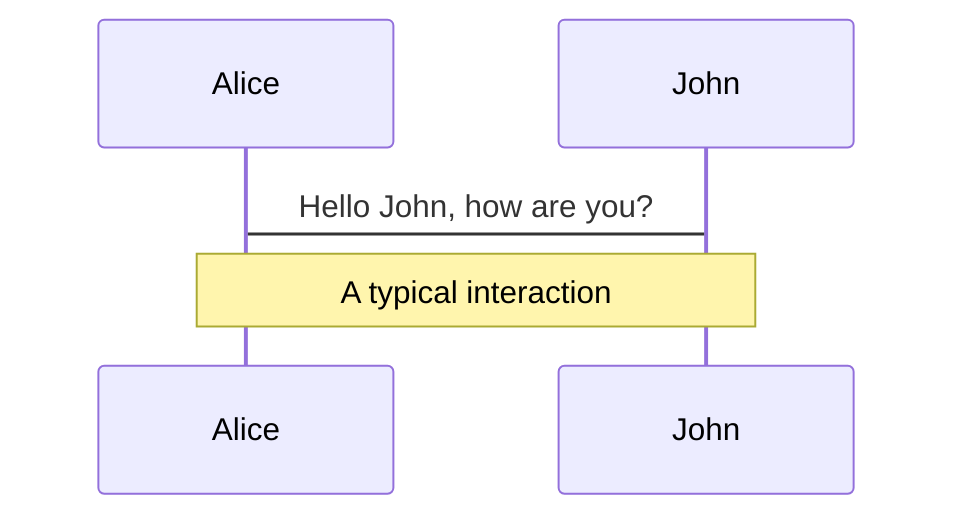
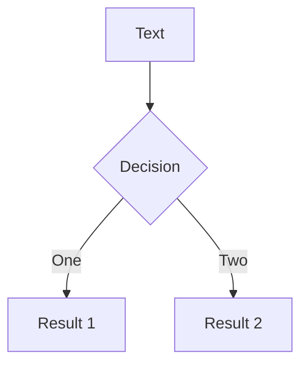

---
# try also 'default' to start simple
theme: purplin
# random image from a curated Unsplash collection by Anthony
# like them? see https://unsplash.com/collections/94734566/slidev
background: https://source.unsplash.com/collection/94734566/1920x1080
# apply any windi css classes to the current slide
class: 'text-center'
# https://sli.dev/custom/highlighters.html
highlighter: shiki
# some information about the slides, markdown enabled
layout: quote
position: center
defaults:
  layout: 'cos5_Common'
  author: 'B4 野中 創矢'
  section: 'section'
info: |
  ## Slidev Starter Template
  Presentation slides for developers.

  Learn more at [Sli.dev](https://sli.dev)
  
---

# Cloud RAN for Mobile Networks—A Technology Overview
Aleksandra Checko, Henrik L. Christiansen, Ying Yan, Lara Scolari, Georgios Kardaras, Michael S. Berger, and Lars Dittmann

松田研　B4 野中創矢

---
section: Abstract
---
# Abstract
- クラウド無線アクセスネットワーク(C-RAN)は多くの課題を解決することができる新しいアーキテクチャ
- ベースバンドユニット(BBU)を中央のBBUプールに集約
- 統計的多重化を測り,同相・直交(IQ)データの高速有線伝送に負荷を移す.
- エネルギー効率の高いネットワークを運用可
- ベースバンドの資源のコスト削減に繋がる.
- 負荷分散と協調処理によるネットワーク容量の向上
- 本論文はC-RANの研究を進める人のための出発点

---
layout: quote
position: center

---
# I.Introduction

---
section: I.Introduction
---

# I.Introduction
背景
- 携帯のデータ通信量は増加し続けている.
- 増大するユーザーの需要を満たすため,ネットワーク容量を増やす必要.
- LTEのスペクトル効率がシャノン限界に近づいている.
- ネットワーク容量を増加するために有力な方法
  - セルを追加してHetSNets（Heterogeneous and Small cell Networks）の複雑な構造を構築
  - MIMOやMassive MIMOの技術を実装し,同時同周波数でサービスを提供
- 上記方法ではセル間干渉レベルが増大し,コストも高い

---
section: I.Introduction
---

# I.Introduction
経済的なお話

モバイルネットワークの総所有コストには以下の２つがある.
- **CAPEX（CAPital EXpenditure：資本的支出)**
  - ネットワーク構築に関連する費用.機器,土木,電力,冷房など
- **OPEX(OPerating EXpenditure：事業運営費)**
  - ネットワークを運用するために必要な費用.電力,運用,保守,アップグレード等.
- CAPEXとOPEXは基地局の数が増えると大幅に増加
- 例えば,総消費電力の72%はセルサイトに起因すると推定
---
section: I.Introduction
---

# I.Introduction
赤字になりそうでヤバイ

- ユーザーはデーターを欲しがるが,お金は払いたくない
  - ユーザー1人あたりの平均収入(ARPU)は時間と共に横ばいまたは減少する.
- ネットワークコストが収入を上回る可能性に直面
  - コストとエネルギー消費を最適化する新しいアーキテクチャが必要

<br>
<div grid="~ cols-2 gap-2" style="position:relative;bottom:10px" m="-t-2">
  <p></p>
  
</div>
---
section: I.Introduction
---

# C-RAN

- C-RANは前述した課題を解決する可能性を持つ新しいアーキテクチャ
- ベースバンド処理が集中化され,仮想化されたBBUプールサイト間で共有.
  - 均一ではないトラフィックにも対応できる.
  - 基地局を効率的に利用することが可能
- 従来のアーキテクチャに比べて必要なBBUの数が少ない.
  - 電力やエネルギー消費を抑える.
  - ネットワーク運用コストを削減できる可能性がある.
- 新しいBBUを容易に追加,アップグレードできる.
  - スケーラビリティの向上,メンテナンスが容易に
---
section: I.Introduction
---


# C-RAN

- 仮想化されたBBUプールは異なる事業者間で共有することが可能　
  - RANをクラウドサービス化することができる
- 複数サイトのBBUが1つに集約していることにより,ICICやCoMPが容易になる.
- セル間の負荷分散も容易になる
- intra-BBUプール間のハンドオーバーを軽減することでネットワーク性能も向上する
---
section: I.Introduction
---


# C-RANの対抗馬

- C-RANは5Gにおいて,ソフト技術とグリーン技術を統合したモバイルネットワークの典型的な実現方法の１つ
- C-RAN以外の解決法として例えば以下の3つがある
  - スモールセル(HetsNetsの一部)
  - Massive MIMO
- スモールセルは屋外のホットスポット,屋内のカバーに
- LightRadioのような技術により,数Lの箱に全てのBSを構築可能
- 屋外に設置可能で,冷却などのコストを削減できる
- C-RANと比べ,アップグレード,修理が難しい
---
section: I.Introduction
---


# HetNet#とは

<div grid="~ cols-2 gap-2" m="-t-2">
  <ul>
    <li>ヘテロジニアスネットワーク (HetNet: Heterogeneous Network)</li>
    <li>マクロセルの他にスモールセルを導入し負荷分散</li>
    <li>収容可能なユーザ数の拡大を図っている</li>
　 </ul>
  
</div> 
---
section: I.Introduction
---

# スモールセル#とは

<div grid="~ cols-2 gap-2" m="-t-2">
  <ul>
    <li>半径数百メートルより小さい通信可能エリア</li>
    <li>マクロセルだけではカバーできない範囲をスモールセルで局所カバー</li>
    <li>大体箱を設置するだけでいい(LightRadio技術)</li>
　 </ul>
  
</div> 
---
section: I.Introduction
---

# Massive MIMO#とは

<div>
  
</div> 
---
section: I.Introduction
---

# Massive MIMO#とは

<div>
  
</div> 
---
section: I.Introduction
---

# Massive MIMO#とは

<div>
  
</div> 
---
section: I.Introduction
---

# C-RANの対抗馬(スモールセル)

- スモールセルは屋外のホットスポット,屋内のカバーに
- LightRadioのような技術により,数Lの箱に全てのBSを構築可能
- 屋外に設置可能で,冷却などのコストを削減できる
- C-RANと比べ,アップグレード,修理が難しい
- C-RANのような協調機能はない
---
section: I.Introduction
---

# C-RANの対抗馬(HetSNets,Massive MIMO)

- 大規模スモールセルネットワークはMassiveMIMOよりもエネルギー効率が高い
- LTE マクロ基地局,LTE C-RAN,LTE スモールセルの8年間のCAPEX,OPEXを含むTCOを比較
  - 1Mb/sあたりの総輸送コスト
  - マクロセル:2200\$,C-RAN:1800\$,スモールセル:600\$
  - C-RANは高い輸送コストに見合った大きなメリットが必要
- スタジアム中継等の特殊ケースでC-RANを利用すると良い？
- 安価,無料なファイバーリソースを利用できる事業者にとってCーRANは魅了的
---
section: I.Introduction
---

# 本論文について

- 本論文ではC-RANとその実装に関する最新の文献を調査.
- 本論文の構成は以下の通りである.
  - Section 2:C-RANアーキテクチャの基本的な側面の紹介
  - Section 3:C-RANアーキテクチャの利点
  - Section 4:利点を活用するための課題
  - Section 5:C-RANのトランスポートネットワーク容量に関するいくつかの制約
  - Section 6,7:C-RAN実現に必要な最先端ハードウェアソリューション
  - Section 8:BBUプール内に導入可能な仮想技術
  - Section 9:C-RAN展開シナリオの評価
  - Sectiono 10:C-RANに関する進行中の研究
  - Section 11:まとめ
---
layout: quote
position: center
---
# II. WHAT IS C-RAN?

---
section: II. WHAT IS C-RAN?
---

# この章は？

- C-RANはベースバンドリソースをプールし,基地局間で共有できるようにしたもの
- 本章では基地局の進化とC-RANコンセプトの基礎について紹介 
<div style="position:relative" m="-t-2">
  
</div>
---
section: II. WHAT IS C-RAN?
---

# 基地局の構造

- モバイルネットワークがカバーする領域はセルに分割されている
- ユーザーは自分がいるセルをカバーする基地局と通信している.
- 基地局の主な機能はベースバンド処理モジュールと無線モジュールの2つ
- ベースバンド処理:符号化,変調,FFT　　無線:デジタル処理,周波数フィルタリング,電力増幅
<div style="position:relative" m="-t-2">
  
</div>
---
section: II. WHAT IS C-RAN?
---

# A. Traditional Architecture

<div grid="~ cols-2 gap-2" m="-t-2">
  <ul>
    <li>従来アーキテクチャではベースバンド処理機構と無線機構が一緒</li>
    <li>アンテナモジュールは無線モジュールの近くに配置されている</li>
    <li>基地局間はX2インターフェースでつながっている</li>
    <li>基地局とモバイルコアネットワーク間はS1インターフェースでつながっている</li>
    <li>1Gや2Gにてよく用いられた</li>
　 </ul>
  
</div>
---
section: II. WHAT IS C-RAN?
---

# B. Base Station With RRH
<div grid="~ cols-2 gap-2" m="-t-2">
  <ul>
    <li>RRH(Remote Radio Head)を用いたアーキテクチャ</li>
    <li>基地局を無線ユニットと信号処理ユニットに分離する</li>
    <li>無線ユニットはRRHまたはRRU(Remote Radio Unit)と呼ばれる</li>
    <li>RRHはファイバーへのインターフェースを提供し,無線処理を行う</li>
    <li>信号処理ユニットはBBUまたはDU(Data Unit)と呼ばれる</li>
　 </ul>
  
</div>
---
section: II. WHAT IS C-RAN?
---

# B. Base Station With RRH

- 3Gにて導入され,現在では大半がこのアーキテクチャをとる
- RRH-BBU間の距離は最長40km
- 光ファイバーやマイクロ波による接続が可能
- BBUを便利でアクセスしやすい場所に設置することができ,コスト削減につながる
- RRHはBBUに静的に割り当てられ,1つのBBUで多数のRRHにも対応できる
---
section: II. WHAT IS C-RAN?
---

# B. Base Station With RRH

- RRHとBBUを繋ぐIrインターフェースが定義されている.
- CPRI(Common Public Radio Interface)というIr上のRRH-BBU間IQデータ伝送に使用されるプロトコルがある.
- OBSAI(Open Base Station Architecture Initiative),ORI(Open Radio Equipment Interface)等のプロトコルも使用可能
---
section: II. WHAT IS C-RAN?
---


# C. Centralized Base Station Architecture—C-RAN

<br>
<div grid="~ cols-2 gap-2" m="-t-2">
  <ul>
    <li>C-RANではBBUをBBU/DU PoolまたはHotelと呼ばれる1つのエンティティに集中させる.</li>
    <li>高負荷の基地局と低負荷の基地局の間でBBUの利用を最適化</li>
    <li>BBUプールはセルサイト間で共有され仮想化された,BBUのクラスタ.</li>
　 </ul>
  
</div>
---
section: II. WHAT IS C-RAN?
---


# C. Centralized Base Station Architecture—C-RAN

<br>
<div grid="~ cols-2 gap-2" m="-t-2">
  <ul>
    <li>X2インターフェースはX2+と新た強い形でクラスター間の通信を整理</li>
    <li>Cは様々な意味にとらえられる</li>
    <li>e.g)Cen-tralized Processing,Cooperative Radio,Collaborative,Clean</li>
　 </ul>
  
</div>
---
section: II. WHAT IS C-RAN?
---


# C. Centralized Base Station Architecture—C-RAN
<br>

<div grid="~ cols-2 gap-2" m="-t-2">
  <ul>
    <li>フロントホールはRRHからBBUまでの範囲をカバー</li>
    <li>バックホールはBBUプールとモバイルコアネットワークを接続</li>
    <li>リモートサイトではRRHはアンテナと一緒に配置さている.</li>
    <li>RRHは低遅延,高帯域の光トランスポートリンクを通じBBUプール内のプロセッサに接続している</li>
　 </ul>
  
</div>
---
section: II. WHAT IS C-RAN?
---

# C. Centralized Base Station Architecture—C-RAN
<br>

-  IQサンプルはRRH-BBU間で送信される
<br>
<div style="position:relative" m="-t-2">
  
</div>
---
section: II. WHAT IS C-RAN?
---

# 各アーキテクチャの比較
<br>

<div grid="~ cols-2 gap-2" m="-t-2">
  <ul>
　 </ul>
  
</div>
---
layout: quote
position: center
---
# III. ADVANTAGES OF C-RAN

---
section: III. ADVANTAGES OF C-RAN
---
# この章は？
<br>

- C-RANはマクロセルとスモールセルの両方にメリットがある
- 具体的に...
  - 基地局導入と運用コストの削減
  - 消費電力を削減
  - ネットワークアップグレードの柔軟性を高める
  - 不均一なトラフィックへの適応性の実現
  - CoMP,干渉緩和等のLTE-A機能を効率的にサポートできる
  - BBUプールにデータをキャッシュしておくことで,応答時間を短くなる.
    - スモールセルの展開には欠かせない
- 本章では3つの利点を述べC-RAN利用の動機付けを行っていく.
---
section: III. ADVANTAGES OF C-RAN
---


# A. Adaptability to Nonuniform Traffic and Scalability
<br>

<div grid="~ cols-2 gap-2" m="-t-2">
  <ul>
    <li>ユーザーは異なるエリアを往来</li>
    <li>右図はネットワーク負荷の1日の変化を表す</li>
    <li>ユーザーがオフィスから住宅地に移動すると移動先のエリアで膨大な処理能力が浪費される</li>
    <li>C-RANでは複数セルのベースバンド処理をBBUプールで行うため全体の利用率を向上できる</li>
　 </ul>
  
</div>
---
section: III. ADVANTAGES OF C-RAN
---


# A. Adaptability to Nonuniform Traffic and Scalability
<br>

- BBUプールに必要なBBU数は単一基地局の合計よりも小さくなる.
  - 東京都市圏では従来に比べ75%,BBUの数を削減できることが示されている.
  - 特定のトラフィックパターンの場合,必要なBBUが従来よりも4倍少なく済む
- 統計的多重化利得はトラフィックミックスに応じて1.2~1.6の間で変化し,17~38%の節約が可能になる
---
section: III. ADVANTAGES OF C-RAN
---

# A. Adaptability to Nonuniform Traffic and Scalability
<br>

- 基地局間の処理負荷のばらつきを利用し集中型アーキテクチャを構築することで,計算資源を少なくとも22%節約できる可能性
- データトラヒックが計算資源利用率の変動に影響を与えることは証明されている.
  - 複数のセクターを1つのクラウド基地局に集約すれば大幅な多重化が可能になる.
  - e.g)57セクターを1つのBBUプールに集約すると計算資源が25%節約できる
---
section: III. ADVANTAGES OF C-RAN
---

# A. Adaptability to Nonuniform Traffic and Scalability
<br>


- 統計的利得の最大化
  - トラフィックプロファイルに合わせてRRH-BBUプール間で柔軟に再構成可能なマッピングを用いる.
  - 特定のトラフィックプロファイルを持つRRHを異なるBBUプールに接続する.
- アップグレードには新しくRRHを設置しBBUプールにつなげるだけで良い
- BBUプール自体はハードウェアを交換,新設することでアップグレード可能
- BBUプールとセルの両方でロードバランシングが可能
  - BBU側:BBUプール内の適切なBBUリソース割り当て問題
  - セル側:動的にBBUが割り当てられるので,制約なしにユーザーのセルを切り替える
---
section: III. ADVANTAGES OF C-RAN
---


# B.Energy and Cost Savings Coming From Statistical Multiplexing Gain in BBU Pool
<br>

- エネルギーを節約した結果としてコストが削減できる
  - C-RANは従来のRANと比べ67%~80%の電力削減を可能にすると見積もられている
- 合計でCAPEXは15%,OPEXを50%削減できると考えられている
- BBUプール-RRH間では問題も
  - BBUプール-RRHサイト間のファイバー費用がCAPEXを増加させる可能性
  - RRH-BBU間で伝送されるIQデータは大きなオーバーヘッドをもたらす
  - フロントホールネットワークの設置と運用には大きなコストがかかる.
---
section: III. ADVANTAGES OF C-RAN
---

# C. Increase of Throughput, Decrease of Delays
<br>

- LTE及びLTE-AはC-RANで展開される可能性が最も高い
- ここではeICIC,CoMPでについてその概要を紹介
- eICIC,CoMPをよく理解することで,C-RANの利用機会について分かる
---
section: III. ADVANTAGES OF C-RAN
---

# C. Increase of Throughput, Decrease of Delays
<br>

- LTEでは通信にOFDMA(直行周波数分割多重アクセス)を利用
  - 共有リソースsのみで動作.
  - LTEの基地局(evoleved Node B:eNB)にはリソース割り当てを行うスケジューラーがある.
- 周波数再利用率が1であり,全てのセルが同一周波数で動作
  - セル間干渉が非常に大きい
- 干渉を抑えるための2つのアプローチ
  - 1.干渉を最小限に抑える
  - 2.干渉経路を建設的に利用する
---
section: III. ADVANTAGES OF C-RAN
---

# 1) Minimizing Inter Cell Interference
<br>

- セル間干渉は静的,動的に解決可能
- 静的方法
  - そもそも同一周波数を使わない
  - 隣接セルで異なる周波数を利用
  - ハードな周波数再利用と呼ばれる
- フラクショナルな周波数再利用も可能
- しかしlower bandsの周波数資源は乏しいため,周波数再利用法以外の方法が良い
- 本セクションでは全てのセルで同一周波数を使用されている場合に焦点を当てる
---
section: III. ADVANTAGES OF C-RAN
---

# 1) Minimizing Inter Cell Interference
ICIC（Inter-cell Interference Coordination：セル間干渉調整）

<div grid="~ cols-2 gap-2" m="-t-2">
  <ul>
    <li>1.UEが特定のサブキャリアで強い干渉を受信</li>
    <li>2.eNBに報告</li>
    <li>3.サブキャリアが特定のUEに使用されないよう,各eNBが近隣セルと連携し調整</li>
    <li>これらはセル端のUEにのみ適用され,セル中央付近では全てのリソースを利用可能</li>
　 </ul>
  
</div>
---
section: III. ADVANTAGES OF C-RAN
---

# III. ADVANTAGES OF C-RAN
1) Minimizing Inter Cell Interference
- 比較的シンプルなソリューション
- eNBは負荷情報とスケジューリング情報を交換するだけで済む
- 欠点も存在
  - 隣接セルの干渉を考慮しなければいけない場合,最適なスケジューリングが決定できない
  - 制御チャネルは固定リソースで送信されるため,干渉が発生する.
---
section: III. ADVANTAGES OF C-RAN
---

# III. ADVANTAGES OF C-RAN
1) Minimizing Inter Cell Interference
- eICIC(enhanced ICIC)
- 特定のサブフレームがミュートされることを意味するABS(Almost Blank Sub-Frames)を導入
  - CRSなどの一部の信号は送信されているため,Almost
- 信号をミュートし,その間に重要な情報を送信できるようになる.
---
section: III. ADVANTAGES OF C-RAN
---

# III. ADVANTAGES OF C-RAN
2) Utilizing Interference Paths Constructively
- CoMP(Coordinated Multi-Point)
  - 干渉を有用な信号に変えるという考え方
- グループ化された複数セル(CoMPセット)が協力してユーザーにサービスを提供
- DLではCoMPセット内の基地局間で緊密な同期と調整が必要
---
section: III. ADVANTAGES OF C-RAN
---

# III. ADVANTAGES OF C-RAN
2) Utilizing Interference Paths Constructively
- 単純なCoMP
  - ICICの例として見れる
- 1UEは1eNBのみからの信号を受信
- CoMPセット内の残りのeNBは干渉を避けるために支援を行う
  - 支援方法:
  - 特定のサブキャリアを使用しない(CS-Coordinated Scheduling)
  - ビームフォーミングなどの特殊なアンテナを使用する(CB-Coordinated Beamforming)
- CS/CBでは1つの基地局が1つのユーザーに対して同時に送信を行うため基地局の同期が必要(周波数0.05ppm、タイミング3μsの精度)
---
section: III. ADVANTAGES OF C-RAN
---

# III. ADVANTAGES OF C-RAN
2) Utilizing Interference Paths Constructively
- CS/CBの発展系としてDCS(Dynamic Cell Selection)がある.
- CoMPセット内の全てのセルでUEに送信されるデータが利用可能
- 送信する1つのeNBを選ぶ
  - 移動体への送信経路が最も有利なeNBから送信ができる
- CS/CBと同レベルの基地局同期が必要
---
section: III. ADVANTAGES OF C-RAN
---

# III. ADVANTAGES OF C-RAN
2) Utilizing Interference Paths Constructively
- 共同送信(JT:Joint Transmission)は最も進んだCoMPシナリオ
- CoMPセット内の全てのセルでUEに送信されるデータが利用可能
- 複数のセルが共同で1人のユーザーに送信
  - 複数の基地局からタイムリーで正確なチャネル特性のフィードバックが必要
  - CSI(Channel State Infomation)を用いる
---
section: III. ADVANTAGES OF C-RAN
---

# III. ADVANTAGES OF C-RAN
2) Utilizing Interference Paths Constructively
- シングルユーザーJT
- 複数のセルが単純に1UEに同データを送信
  - 受信側で合成し,SINRゲインを得ることができる.
- 複数のセルを使用するため再利用率が1/3になってしまう.
  - 負荷の軽いシステムに最も適している
- DCSと組み合わせることで,動的に　CoMPセットを変化されることができる.
- 負荷の高いシステムにはJTをマルチユーザーJTに拡張する
---
section: III. ADVANTAGES OF C-RAN
---

# III. ADVANTAGES OF C-RAN
2) Utilizing Interference Paths Constructively
- マルチユーザーJT
- ユーザーグループが(時間-周波数)リソースを共有することができる.
- 緊密な基地局の同期を必要とする.
- C-RANベースのアーキテクチャでの使用に適する
---
section: III. ADVANTAGES OF C-RAN
---


# III. ADVANTAGES OF C-RAN
2) Utilizing Interference Paths Constructively
- C-RANと一緒に使うことの利点
- CoMPでは干渉をさらに低く抑えられ,クラスタリングと組み合わせることで無線帯域を効率的にも利用できる
  - スペクトル効率の向上(UL)
  - セル内JT:13%　　セル外JT:20%
  - セル内JT:75%　　セル外JT:119%(セルエッジユーザー)
- ICICでは複数セルの送信を管理するセントラルユニットをBBUプール常に構築できる.
---
section: III. ADVANTAGES OF C-RAN
---

# III. ADVANTAGES OF C-RAN
2) Utilizing Interference Paths Constructively
- C-RANによりX2インタフェース使用量を削減できる.
  - CoMPは10~15%の共同処理利得を獲得
  - ICICは10~30%のメルチセル無線リソース管理(Radio Resource Management:RRM)を獲得
- キャリア周波数オフセットが±3〜5ppbを超えない場合,容量とカバレッジの両方で顕著な性能向上を達成する.
  - e.g)Cell-Average:20%　　Cell-Edge:52%
- Multi-Cell MIMOのようなプール強調技術を強化できる
  - C-RANによるアンテナ選択戦略は従来の戦略よりも優れた結果を示している.
---
section: III. ADVANTAGES OF C-RAN
---


# III. ADVANTAGES OF C-RAN
3) Decrease of the Delays
- ハンドオーバーeNB間でなくBBUプール内で行えるため,その分の時間を短縮できる
- GSM（Global System for Mobile Commu-nications）
  - ハンドオーバーの平均割り込み時間の合計が短くなり、シグナリングが減少
- UMTS（Universal Mobile Telecommunications System）
  - lubトランスポートベアラのセットアップとトランスポート帯域幅の要件が低減される
  - しかし性能の向上はユーザーには感じられないかもしれない.
- LTE X2 ベースのeNB間ハンドオーバー
  - 遅延と失敗率の減少
  - コアモバイルネットワークに送信されるシグナリング情報が減少
---
section: III. ADVANTAGES OF C-RAN
---

# III. ADVANTAGES OF C-RAN
D. Ease in Network Upgrades and Maintenance
- BBUが集中化されているのでアップグレード,管理が楽
- BBUが遠隔地にある場合に比べ,より頻繁にCPUを更新できる.
- SDR（Software Defined Radio）
  - 信号生成、符号化、リンク層プロトコルなどの無線機能をソフトウェアで実装することができる技術
  - 遠隔操作でプログラミング、アップグレード、最適化が可能なソフトウェア基地局を実現
  - 新しい規格,周波数へのアップグレードはソフトウェアを更新するだけで良い.
- 上記によりマルチモード基地局は、ネットワーク開発やOAM（Operation, Administration and Maintenance）のコストを軽減

---
section: III. ADVANTAGES OF C-RAN
---


# IV. CHALLENGES OF C-RAN
- C-RANを商業展開する前に解決しなければならない問題がある.
- 本章では以下の課題を紹介
  - A. 高い帯域幅,厳しい遅延ーとジッター,及び低コストのトランスポートネットワーク
  - B.BBUの協調,相互接続,クラスタリング技術の開発
  - C.BBUプールの仮想化技術の提案
---


# IV. CHALLENGES OF C-RAN
A. High band- width, strict latency and jitter as well as low cost transport net- work needs to be available
- C-RANではRRH-BBUプール間の光リンクに膨大なオーバーヘッドが発生する.
- IQデータのサイズに影響を与える要因
  - ターボコード(1:3のものが採用されているためオーバーヘッド3倍)
  - CPRIなどインターフェースのIQサンプル幅
  - LTE信号のオーバーサンプリング(LTEでは30.72MHzのサンプリング周波数が標準だが,これはナイキスト周波数20MHzより高い)

---

# IV. CHALLENGES OF C-RAN
A. High band- width, strict latency and jitter as well as low cost transport net- work needs to be available
- C-RANではRRH-BBUプール間の光リンクに膨大なオーバーヘッドが発生する.
- IQデータのサイズに影響を与える要因
  - ターボコード(1:3のものが採用されているためオーバーヘッド3倍)
  - CPRIなどインターフェースのIQサンプル幅
  - LTE信号のオーバーサンプリング(LTEでは30.72MHzのサンプリング周波数が標準だが,これはナイキスト周波数20MHzより高い)
---


# IV. CHALLENGES OF C-RAN
A. High band- width, strict latency and jitter as well as low cost transport net- work needs to be available

$$
IQBandwidth = samplingFrequency * sampleWidth * 2 * lineCoding * MIMO * noOfSectors
$$ 
- 上式はIQ帯域幅に影響を与える要因をまとめた式
- 以下の表はセルサイトとBBU間の期待されるIQビットレートをまとめたもの

---


# IV. CHALLENGES OF C-RAN
A. High band- width, strict latency and jitter as well as low cost transport net- work needs to be available

- 遅延とジッター要件に様々な制約がかかる.
  - JTを利用にするには基地局間の照合に0.5μsのタイミング精度が要求されている.
  - ユーザーデータの往復遅延は,各リンクまたはホップで±16.276nsの精度で測定した場合,5μsを超えてはいけない
  - HARQ要求を満たすために,RRHとBBU間のリンクにおけるサブフレーム処理遅延は,1ms以下に抑える
  - RRHとBBU間の最大距離は20-40kmを超えてはいけない
---


# IV. CHALLENGES OF C-RAN
B. BBU Cooperation, Interconnection and Clustering

- CoMPを利用するには基地局間の協力が不可欠
- BBUを接続する方法は広帯域で低遅延の信頼性が高く,低コストで,RRHを相互に接続する柔軟なトポロジーを備えている必要
  - SDH（Synchronous Digital Hierarchy）などの従来の光ネットワークと同等以上の信頼性が必要
  - ファイバーリングネットワークプロテクションなどの仕組みを利用できる
---


# IV. CHALLENGES OF C-RAN
B. BBU Cooperation, Interconnection and Clustering

- CoMPを容易にする,過負荷を防ぐためにセルは1つのBBUプールに割り当てられるべき
  - セルを最適にクラスタリングする.
  - 干渉を分析した後に最適なセルーBBUプールの割り当てが行われる.
- C-RANのエネルギーを節約するためには稼働するBBU/RRHが最適になるよう基地局を選択する必要
- 大きなセル間干渉(ICI)に対し,スペクトル効率を上げる協調的な送受信戦略が必要
 - C-RANのスケジューラがうまく機能してるかもどうかもスペクトル効率に影響を与える.
- トラフィックの需要に応じてBBUとRRHの接続を動的に変更できるColony RAN
  - C-RANのための準静的および適応的なBBU-RRH切り替え戦略が考案され,評価されている.
  - 静的な戦略と比べ,準静的では26%,適応的では47%BBUが節約できるとされる.
---


# IV. CHALLENGES OF C-RAN
C. Virtualization Technique

- 仮想基地局間で処理を分散,グループ化し複数のオペレーターで資源を共有するための仮想化技術が提案される必要性
- どのような仮想化技術でありリアルタイムに動作することを期待
- 動的に変化するセル負荷に対応する処理能力の割り当て技術が必要
- 表はクラウドコンピューティングとC-RANのクラウドインフラに対する要件の比較


---


# V. TRANSPORT NETWORK TECHNIQUES

- 本章ではC-RANを実現するための技術的な解決策を紹介
  - A.C-RANの内部アーキテクチャと物理媒体を評価
  - B,C-RANをサポートする可能性のあるトランスポート層のソリューションを評価
  - D.現在利用可能なIQ圧縮/伸長法
- 本論文ではC-RANの特徴のフロントホールネットワークのトランスポートネットワークに焦点
---


# V. TRANSPORT NETWORK TECHNIQUES
A. Physical Layer Architecture and Physical Medium (1)
- トランスポートネットワークのオーバーヘッドを削減するために,基地局機能をRRHとBBUに分割する方法は2つある
  - 完全集中型(a)
  - 部分集中型(b)
 <div grid="~ cols-2 gap-2" m="-t-2">
  
  
</div>
---


# V. TRANSPORT NETWORK TECHNIQUES
A. Physical Layer Architecture and Physical Medium (1)
 <div grid="~ cols-2 gap-2" m="-t-2">
  <ul>
    <li>完全集中型</li>
    <li>L1,L2,L3の機能はBBUプールに全て存在</li>
    <li>RRHとBBUの間で高帯域のIQデータ伝送が内的に発生</li>
  </ul>
  
</div>
---

# V. TRANSPORT NETWORK TECHNIQUES
A. Physical Layer Architecture and Physical Medium (1)
 <div grid="~ cols-2 gap-2" m="-t-2">
  <ul>
    <li>部分集中型</li>
    <li>L1処理はRRHと同居</li>
    <li>光トランスポートリングの帯域幅負担を軽減</li>
    <li>しかし,リソースの共有が大幅に減少</li>
    <li>CoMP等の機能を効率的にサポートできない</li>
  </ul>
  
</div>
---


# V. TRANSPORT NETWORK TECHNIQUES
A. Physical Layer Architecture and Physical Medium (1)
- 集中型と部分型の中間のもの
- L1処理の特定機能のみをRRHと共同で配置する
- e.g)セル/セクター固有機能であるL1前処理をRRHと共同配置し,他大部分はBBUに残す
---


# V. TRANSPORT NETWORK TECHNIQUES
A. Physical Layer Architecture and Physical Medium (2)
- 集中型と部分型の中間のもの
- L1処理の特定機能のみをRRHと共同で配置する
- e.g)セル/セクター固有機能であるL1前処理をRRHと共同配置し,他大部分はBBUに残す
---

# V. TRANSPORT NETWORK TECHNIQUES
A. Physical Layer Architecture and Physical Medium (2)
- ファイバー接続 vs 無線接続
- 2014年には世界規模で基地局の35％だけがファイバーで接続,55％が無線技術で接続,残り10％が銅で接続されると予想
- ファイバー接続の世界シェアは拡大、北米はバックホール接続に占めるファイバーの割合が62.5%にもなる.
- 将来的には100Gbpsのファイバーが利用できる
- Eバンドマイクロ波伝送により99.999%のリンク可溶性を保証するために1~2km,99.9%であれば5~7kmの距離でGbpsの容量を提供できる
- スモールセルの展開ではWi-Fiが無線バックホーリングの方法として考えられている.
- 同様の方法でWi-fiをフロントホーリングに仕様でいる可能性がある.
- 結論としてC-RANの導入はRRH-BBUプール間にファイバーリングがある場合のみ可能.
  - 部分集中化アーキテクチャではRRH-BBUプール間の伝送媒体にマイクロ波を使用できる.
---

# V. TRANSPORT NETWORK TECHNIQUES
B. Transport Network
- 物理媒体としてファイバーが最も有力
- ここでは以下のトランスポートネットワークソリューションについて説明.
  - ダークファイバー
  - WDM/OTN: 波長分割多重（WDM）/光伝送ネットワーク（OTN）
  - Unified Fixed and Mobile Access
  - Carrier Ethernet
---

# V. TRANSPORT NETWORK TECHNIQUES
B. Transport Network (Dark Fiber)
- 10台以下のマクロ基地局を有するBBUプールでは,容量要件の観点からダークファイバーが好ましい
- ダークファイバは光伝送ネットワーク機器を追加する必要がない
  - 迅速かつ低コストに導入可能
- しかしファイーバー資源を大量に消費
  - ネットワークの拡張性が課題
- 障害発生時には新たな保護機構が必要
- が,これらの課題は解決できる
---


# V. TRANSPORT NETWORK TECHNIQUES
B. Transport Network (WDM/OTN)
- ファイバー資源が限られているマクロ基地局に適する.
- 1本の光ファイバで40～80の光波長を伝送することができる
- WDM/OTNへのアップグレードには高いコストがかかる. 
  - 長距離のバックボーンネットワークに比べれば安価に導入できる
- C-RANのための非階層的なWDMベースのアクセスのコンセプトも考案
  - 既に導入されているファイバーを再利用し,共通のファイバーであらゆるトラフィックを伝送できる.
  - 仮想P2P WDMリンクを確立することで1本で最大48の双方向CPRIリンクをサポート可能

---


# V. TRANSPORT NETWORK TECHNIQUES
B. Transport Network (Unified Fixed and Mobile Access)
- 固定ブロードバンドとモバイルアクセスネットワークを組み合わせたもの,UniPONがその1つ
- UniPONはPONサービスとCPRI伝送の両方を提供
- 1本の光ケーブルで14種類の波長を提供
  - コスト削減

---


# V. TRANSPORT NETWORK TECHNIQUES
B. Transport Network (Carrier Ethernet)
- LANの技術であったイーサネットはキャリアのサービスも耐えれる品質を持つようになった
  - キャリアイーサネット
- キャリアイーサネットをRRHからBBUプールに向けて直接適用することもできる.
  - CPRI2Ethernetゲートウェイが必要
  - イーサネットで伝送される異なるCPRIストリームを異なる目的地に転送するための多重化機能を備えている
- 99.999%のサービス可用性を保証
- 最大1,600万人の顧客をサポートすることができる.
- イーサーネットを利用する課題は,同期と合成に厳しい制約があること
  - 周波数精度は±50ppb以内,位相精度は半径3km以下のセルで±1.5μsが必要

---


# V. TRANSPORT NETWORK TECHNIQUES
C. Network Equipment

以下はCーRAN用に開発された機器である.
- CPRI2Ethernet Gateway
  - CPRIデータをイーサネットパケットにマッピングするためのもの
  - トランスポートネットワーク規格としてイーサネットが選択された場合に必要
  - イーサネットで伝送される異なるCPRIストリームを異なる目的地に転送するための多重化機能を備えている
- IQ Data Routing Switch
  - DCN(Dynamic Circuit Network)のFat-Treeアーキテクチャがベース
  - BBU間の負荷分散を容易に実現
  - リアルタイム処理とリンクロードバランシング,リソース管理プラットフォームも導入されている.

---


# V. TRANSPORT NETWORK TECHNIQUES
C. Network Equipment

- CPRI Mux
  - トラフィックを集約し,最小数の光インターフェースで伝送するためにカプセル化する装置
  - IQ 圧縮/伸張が可能で,Coarse WDMやDense WDM用の光インターフェースを備えている.
  - BBU PoolはCPRI muxで多重化された信号を分離する
- x2OTN Gateway
  - CPRI/OBSAIからOTNへのゲートウェイ
  - トランスポートネットワークにOTNを選択した場合に使用

---


# V. TRANSPORT NETWORK TECHNIQUES
D. IQ Compression Schemes and Solutions

- C-RANではフロントホールのデータレートは無線部の12倍から55倍になると予想されている.
- 容量に制約のあるフロントホール上で広帯域の伝送を最適化するためには,効率的な圧縮戦略が必要
- 潜在的な解決策としては以下がある
  - サンプリングレートを下げる,非線形量子化を使う
  - 周波数サブキャリア圧縮,IQデータ圧縮
- 様々な要因を考慮して戦略を練る
<div grid="~ cols-2 gap-2" m="-t-2">
  <p></p>
  
</div>
---

# V. TRANSPORT NETWORK TECHNIQUES
D. IQ Compression Schemes and Solutions

- Reducing signal sampling
  - プロトコルへの影響が少なく容易
  - 多少の性能低下はあるが最大66%圧縮率を向上させる
-  Non-linear quantization
  - より多くの値が存在する可能性のある大きさの領域に対し,高い量子化レベルを設定
  - 量子化SNR（Quanti-zation SNR）が向上
  - ステップサイズの指定にはμ-LawやA-Law等の対数符号化アルゴリズムが使用可能
  - 最大53%の圧縮効率が得られるが,Irインターフェースがさらに複雑になる.
---


# V. TRANSPORT NETWORK TECHNIQUES
D. IQ Compression Schemes and Solutions(IQ data compression)

- IQ data compression
  - DAGC（Digi-tal Automatic Gain Control)等を用いて行うことができる.
  - DLにおいてSNR（信号対雑音比）やEVM（エラー・ベクトル・マグニチュード）が悪化する
  - 潜在的には高い圧縮率が得られるが,複雑であり良いアルゴリズムがない
-  Subcarrier compression
  - FFT/IFFTブロックをRRHに実装することでIrインターフェースの負荷を40%低減することができる.
  - DLでは簡単に実行できるが,RACHの処理は大きな課題
  - IQマッピングやシステムの複雑性を高める.
  - 高価な機器,より多くのストレージ,より大きなFPGA処理能力が必要
---

# V. TRANSPORT NETWORK TECHNIQUES
D. IQ Compression Schemes and Solutions(IQ data compression)
 <div grid="~ cols-2 gap-2" m="-t-2">
  <ul>
    <li>表は本論文で紹介した圧縮方式をまとめたもの</li>
    <li>BBUプールの費用対効果を失わないためには,相当量のファイバーを所有するかIQ圧縮を行う必要がある.</li>
    <li>さらに光高速モジュールのコストを従来のSDHトランスポート機器と同等に保ちたい.</li>
  </ul>
  
</div>
---


# VI. RRH DEVELOPMENT
- C-RANと互換性のあるRRHの要件とソリューションを紹介
- 従来のRRHとの違い
  - 従来は信号の移動距離が数kmであったが,C-RANで距離がさらに長くなる
  - 伝送距離の増加によって生じる追加の遅延を監視する必要がある
- より高いビットレートをサポートする必要も
  - より多くのトラフィックに対応するためには規格のアップグレードが必要
- 既存のCPRIなどのインターフェースを長距離用に再定義したほうがいいかもしれない
  - NGMNでは将来のプロトコル候補としてORIを想定

---


# VII. SYNCHRONIZED BBU IMPLEMENTATION
- この章ではBBUに関する考察を行う.
- BBU間の相互接続には低遅延,高速,高信頼性,10Gbpsのリアルタイム伝送が求められる.
- さらにCoMP,動的キャリアスケジューリング,1+1障害保護をサポートし,高いスケーラビリティを提供する必要
- 中規模都市ネットワーク(カバー範囲5×5km)では100台の基地局,15×15kmでは1000台の基地局をサポートする必要
- BBUプールの物理的特性を隠し,動的なリソース割り当てを可能にするために基地局リソースの仮想化が必要
- リアルタイム仮想化の課題
  - 高性能で低消費電力の信号処理,リアルタイム信号処理
  - BBUの相互接続,BBU内のチップ間,物理ラック内のBBU,ラック間の接続
---


# VII. SYNCHRONIZED BBU IMPLEMENTATION
A. Current Multi-Standard Open Platform Base Station Solutions

- 通信事業者は複数の規格に対応する必要があるため,マルチモード基地局は自然な選択
- SDR技術などを用いてハードウェアとソフトウェアを分離することで,異なる無線規格や様々なサービスをスムーズに導入することができる
- 従来では独自のプラットフォーム上に基地局が構成されている.
- C-RANはオープンなプラットフォーム上に基地局を構築することを目的としている
  - 互換性のない複数のプラットフォームを管理する必要がない
  - アップグレードの柔軟性を高め,革新的なアプリケーションやサービスの創出を促進
---


# VII. SYNCHRONIZED BBU IMPLEMENTATION
B. Processors

- 現在,無線システムにはFPGA(Field-Programmable Gate Arrays)や組み込みDSP(Digital Signal Processor)が使用されている
  - IT分野のGPP(General Purpose Processor)の処理能力が向上したことにより,GPPベースのシグナルプロセッサを使用する可能性も出てきた.
 DSPについて
- C-RANにとって重要なことは,DSP上で動作するリアルタイムOSにより処理リソースをリアルタイムに仮想化できること
  - しかし下位互換性は保証されていない.
- C-RANアーキテクチャが従来のRANと比較して消費電力を削減するために,信号処理装置の消費電力の検討が不可欠
  - 同じ処理能力であればDSPはGPPに比べ低価格
---

# VII. SYNCHRONIZED BBU IMPLEMENTATION
B. Processors

GPPについて
- マルチコア処理,単一命令マルチデータ,低遅延オフチップシステムメモリ,大容量オンチップキャッシュなどにより使用が容易に
- 後方互換性も確保
  - BBUのアップグレードもスムーズに行える
- リアルタイム性を備えた複数のOSにより,基地局の信号処理を仮想化することができる
- LTEリアルタイム要件を満たすかが懸念事項
  - 4コアのマルチコア実装であれば遅延は範囲内におさまるはずである
  - ターボデコーダーを最適化する方法もある.
  - 複数のスレッドとスマートな実装を用いることで,3GPP要件を満たすことができることが証明されている
---

# VII. SYNCHRONIZED BBU IMPLEMENTATION
B. Processors

DSPとGPPをまとめた表


---


# VIII. VIRTUALIZATION

- この章では無線ネットワークの仮想化に関する研究開発について紹介
- 無線仮想化アーキテクチャ、ハードウェアプラットフォーム、リンクリソースに関する技術も紹介
- さらにソフトウェア定義ネットワーク(SDN)とネットワーク機能仮想化(NFV)に関する進行中の研究を紹介
---


# VIII. VIRTUALIZATION
A. Virtualization Concept

- ネットワーク仮想化はC-RANを実現する上で重要な技術
  - 抽象化された物理ネットワーク上に論理的に分離されたネットワークを構築する
  - 同一の物理基板上に複数の仮想ネットワークが共存する.
- BBUプールではネットワークの仮想化はデータストレージだけでなく,アプリケーション,OS,管理制御も分離する.
- BBUはハードウェアプラットフォーム上で動作し,LinuxなどのOSを介して実装される.
- 基地局の機能は仮想基地局(VBS)と呼ばれるソフトウェアインスタンスとして実現される
---


# VIII. VIRTUALIZATION
A. Virtualization Concept

- ハードウェアやシステムなどの共通リソースをVBS間で共有
  - 効率的かつ柔軟な利用が可能に
- VBSプール内では複数の仮想オペレータが共通のネットワーク,プログラミング環境,ITプラットフォームを有する
- 仮想マシンは物理マシンと同じネットワーク特性を持つ.
<div grid="~ cols-2 gap-2" m="-t-2"> 
  <p></p>
  
</div>
---


# VIII. VIRTUALIZATION
A. Virtualization Concept

- VBSの導入には以下のような理由がある
  - 異なる認証メカニズムでサービスを提供する
  - テストベッド環境のコスト削減と時間の短縮
  - 仮想オペレータの追加や削除などのスケーラビリティ
    - 一般的な傾向としてIaaSの開発が進んでいる
    - RANをクラウドサービスのように提供するRANaaSなど
---


# VIII. VIRTUALIZATION
A. Virtualization Concept

ネットワーク仮想化の課題
- 計算機資源の仮想化
  - 規模な並列処理,OS内の計算遅延の最小化,VBSエンティティ間の通信遅延の最小化.基地局間のクロックの同期化などが必要
- ネットワーク資源の仮想化
  - 無線ネットワークのもう1つの側面は仮想無線インターフェース
  - 媒体の性質上,物理的なリンクが変化しやすく,接続するユーザーも頻繁に変化する
  - 仮想無煙通信事業者間で無線インターフェースを共有する場合,切り替え,認証やセキュリティの違い,帯域資源の使用方法の違いなどの課題がある
---


# VIII. VIRTUALIZATION
B. Virtualization Solutions

Proposals on Wireless Network Virtualization Architecture
- GENI（Global Environment for Network Innovations）では無線ネットワーク仮想化のネットワークプラットフォームを提案・開発している
- Wi-Fiネットワークで使用されているソリューションは,スモールセルにも適用可能であるため,モバイル・ネットワークのヒントにもなりうる.
- LTEではZakiらおよびZhaoらが,LTEの無線仮想化に関する要件と設計上の課題をシミュレーションによって検討している
---


# VIII. VIRTUALIZATION
B. Virtualization Solutions

Proposals on Implementation of Hardware Virtualization
- Intel社はChina Mobile社と共同でC-RAN用の仮想BBUプールのプロトタイプを開発
  - Intel Xeonプロセッサ上で動作し,TD-LTE信号を処理
  - 信号とアプリケーションの処理をより効率的に
- Zhuらは[99]で,従来のソフトウェア無線の概念から無線ネットワーク・クラウドの概念への移行の実現について議論
- Aljabariら[100]は、異なるセキュリティ規格を持つ複数の無線LANを単一の物理インフラ上に実装する際のアプローチを紹介
- LTEではZakiらおよびZhaoらが,LTEの無線仮想化に関する要件と設計上の課題をシミュレーションによって検討している
- Coskunら[101]は省電力メカニズムを使用した仮想802.11インタフェースの実現について発表
- [102]ではネットワーク仮想化によってリンク層とネットワーク層でソフトハンドオーバーを行う方法を提案
---


# VIII. VIRTUALIZATION
B. Virtualization Solutions

Proposals on Implementation of Resource Virtualization
- Liら[103]は複数の仮想事業者(VO)と複数のeNBがスペクトルを共有できるLTE仮想化フレームワークを提案
  - 異なるVOが同一のeNBデバイスを利用し,提案された共有アルゴリズムを使用してスペクトル・リソースを定期的に割り当て
  - 信号とアプリケーションの処理をより効率的に
- Bhanageら[104]は仮想無線LAN（WLAN）ネットワーク・アーキテクチャを提案
  - ユーザグループ間でのUL帯域幅リソース共有という問題に取り組む
- [105]ではCloudMACの導入と評価が行われている.
  - データセンターにホストされた仮想アクセスポイントでMACフレームが生成・処理されるエンタープライズWLAN用のアーキテクチャ
- Zhaoら[98]はLTEの仮想化モデルと,仮想事業者間の多重化利得の向上につながるスペクトル共有戦略について述べている
---


# VIII. VIRTUALIZATION
C. Ongoing Work on SDN and NFV

Proposals on Implementation of Resource Virtualization
- Liら[103]は複数の仮想事業者(VO)と複数のeNBがスペクトルを共有できるLTE仮想化フレームワークを提案
  - 異なるVOが同一のeNBデバイスを利用し,提案された共有アルゴリズムを使用してスペクトル・リソースを定期的に割り当て
  - 信号とアプリケーションの処理をより効率的に
- Bhanageら[104]は仮想無線LAN（WLAN）ネットワーク・アーキテクチャを提案
  - ユーザグループ間でのUL帯域幅リソース共有という問題に取り組む
- [105]ではCloudMACの導入と評価が行われている.
  - データセンターにホストされた仮想アクセスポイントでMACフレームが生成・処理されるエンタープライズWLAN用のアーキテクチャ
- Zhaoら[98]はLTEの仮想化モデルと,仮想事業者間の多重化利得の向上につながるスペクトル共有戦略について述べている
---


# What is Slidev?

Slidev is a slides maker and presenter designed for developers, consist of the following features

- 📝 **Text-based** - focus on the content with Markdown, and then style them later
- 🎨 **Themable** - theme can be shared and used with npm packages
- 🧑‍💻 **Developer Friendly** - code highlighting, live coding with autocompletion
- 🤹 **Interactive** - embedding Vue components to enhance your expressions
- 🎥 **Recording** - built-in recording and camera view
- 📤 **Portable** - export into PDF, PNGs, or even a hostable SPA
- 🛠 **Hackable** - anything possible on a webpage

<br>
<br>

Read more about [Why Slidev?](https://sli.dev/guide/why)

<!--
You can have `style` tag in markdown to override the style for the current page.
Learn more: https://sli.dev/guide/syntax#embedded-styles
-->

<style>
h1 {
  background-color: #2B90B6;
  background-image: linear-gradient(45deg, #4EC5D4 10%, #146b8c 20%);
  background-size: 100%;
  -webkit-background-clip: text;
  -moz-background-clip: text;
  -webkit-text-fill-color: transparent; 
  -moz-text-fill-color: transparent;
}
</style>

---

# Navigation

Hover on the bottom-left corner to see the navigation's controls panel, [learn more](https://sli.dev/guide/navigation.html)

### Keyboard Shortcuts

|     |     |
| --- | --- |
| <kbd>right</kbd> / <kbd>space</kbd>| next animation or slide |
| <kbd>left</kbd> | previous animation or slide |
| <kbd>up</kbd> | previous slide |
| <kbd>down</kbd> | next slide |


<p v-after class="absolute bottom-23 left-45 opacity-30 transform -rotate-10">Here!</p>

---
layout: image-right
image: https://source.unsplash.com/collection/94734566/1920x1080
---

# Code

Use code snippets and get the highlighting directly!

```ts {all|2|1-6|9|all}
interface User {
  id: number
  firstName: string
  lastName: string
  role: string
}

function updateUser(id: number, update: User) {
  const user = getUser(id)
  const newUser = {...user, ...update}  
  saveUser(id, newUser)
}
```

<arrow v-click="3" x1="400" y1="420" x2="230" y2="330" color="#564" width="3" arrowSize="1" />

---

# Components

<div grid="~ cols-2 gap-4">
<div>

You can use Vue components directly inside your slides.

We have provided a few built-in components like `<Tweet/>` and `<Youtube/>` that you can use directly. And adding your custom components is also super easy.

```html
<Counter :count="10" />
```

<!-- ./components/Counter.vue -->
<Counter :count="10" m="t-4" />

Check out [the guides](https://sli.dev/builtin/components.html) for more.

</div>
<div>

```html
<Tweet id="1390115482657726468" />
```

<Tweet id="1390115482657726468" scale="0.65" />

</div>
</div>


---
class: px-20
---

# Themes

Slidev comes with powerful theming support. Themes are able to provide styles, layouts, components, or even configurations for tools. Switching between themes by just **one edit** in your frontmatter:

<div grid="~ cols-2 gap-2" m="-t-2">

```yaml
---
theme: default
---
```

```yaml
---
theme: seriph
---
```


</div>

Read more about [How to use a theme](https://sli.dev/themes/use.html) and
check out the [Awesome Themes Gallery](https://sli.dev/themes/gallery.html).

---
preload: false
---

# Animations

Animations are powered by [@vueuse/motion](https://motion.vueuse.org/).

```html
<div
  v-motion
  :initial="{ x: -80 }"
  :enter="{ x: 0 }">
  Slidev
</div>
```

<div class="w-60 relative mt-6">
  <div class="relative w-40 h-40">
    
    
    
  </div>

  <div 
    class="text-5xl absolute top-14 left-40 text-[#2B90B6] -z-1"
    v-motion
    :initial="{ x: -80, opacity: 0}"
    :enter="{ x: 0, opacity: 1, transition: { delay: 2000, duration: 1000 } }">
    Slidev
  </div>
</div>

<!-- vue script setup scripts can be directly used in markdown, and will only affects current page -->
<script setup lang="ts">
const final = {
  x: 0,
  y: 0,
  rotate: 0,
  scale: 1,
  transition: {
    type: 'spring',
    damping: 10,
    stiffness: 20,
    mass: 2
  }
}
</script>

<div
  v-motion
  :initial="{ x:35, y: 40, opacity: 0}"
  :enter="{ y: 0, opacity: 1, transition: { delay: 3500 } }">

[Learn More](https://sli.dev/guide/animations.html#motion)

</div>

---

# LaTeX

LaTeX is supported out-of-box powered by [KaTeX](https://katex.org/).

<br>

Inline $\sqrt{3x-1}+(1+x)^2$

Block
$$
\begin{array}{c}

\nabla \times \vec{\mathbf{B}} -\, \frac1c\, \frac{\partial\vec{\mathbf{E}}}{\partial t} &
= \frac{4\pi}{c}\vec{\mathbf{j}}    \nabla \cdot \vec{\mathbf{E}} & = 4 \pi \rho \\

\nabla \times \vec{\mathbf{E}}\, +\, \frac1c\, \frac{\partial\vec{\mathbf{B}}}{\partial t} & = \vec{\mathbf{0}} \\

\nabla \cdot \vec{\mathbf{B}} & = 0

\end{array}
$$

<br>

[Learn more](https://sli.dev/guide/syntax#latex)

---

# Diagrams

You can create diagrams / graphs from textual descriptions, directly in your Markdown.

<div class="grid grid-cols-2 gap-4 pt-4 -mb-6">





</div>

[Learn More](https://sli.dev/guide/syntax.html#diagrams)


---
layout: center
class: text-center
---

# Learn More

[Documentations](https://sli.dev) / [GitHub Repo](https://github.com/slidevjs/slidev)
